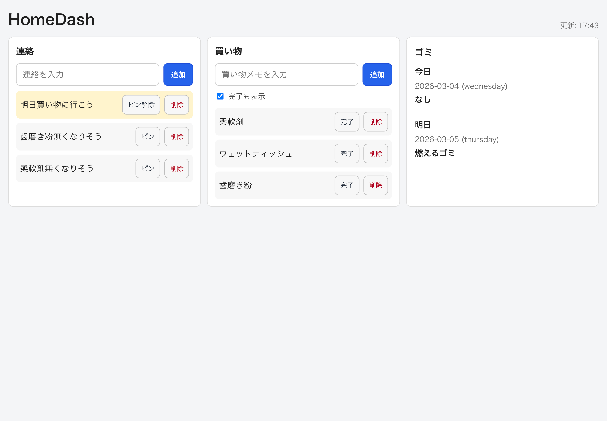

# HomeDash

HomeDash は家庭内LANで運用する「家庭ホワイトボード」アプリです。
MVP0では次の3機能に限定しています。

- 連絡共有（notice）
- 買い物メモ（shopping）
- ゴミ表示（今日・明日）

## 画面イメージ



`docs/screenshots/dashboard.png` はプレースホルダーです。  
運用開始前に実画面のスクリーンショットへ差し替えてください。

## 前提

- 外部公開はしない（家庭内LAN / 必要時はVPN）
- Docker前提で運用する
- データはローカル保存する（SQLite / 設定ファイル）

## バージョニング方針

- 本プロジェクトは SemVer（`vX.Y.Z`）を採用します。
- MVP0の初回リリースは `v0.1.0` とします。
- `v0` 系でも破壊的変更は避け、API互換は `docs/API.md` のルールに従います。
- 変更内容は必ず `CHANGELOG.md` の `Unreleased` に先に追記し、リリース時に確定版へ移動します。

## Dockerタグ方針（現行運用）

- 現在は `docker compose up --build` によるローカルビルド運用です。
- 「どの版を動かしているか」は Gitタグ（`v0.1.0` など）で管理します。
- 更新時は対象タグをチェックアウトして起動し、問題時は1つ前のタグへ戻します。
- 将来的に GHCR などへタグ付き配布する余地はありますが、MVP0では未実装です。

## 運用モード（認証）

### 家庭内LANモード（既定）

- `AUTH_TOKEN` 未設定
- 今まで通り認証なしで利用

### VPN/外部アクセス想定モード（推奨）

- `AUTH_TOKEN` を設定
- `/api/v1/*` は `Authorization: Bearer <token>` が必須
- `/`（Vue画面）は開けますが、トークンなしではAPIが `401` になり画面に認証エラーが表示されます

## 起動方法

1. 必要に応じて `.env.example` をもとに `.env` を作成
2. 次のコマンドで起動

```bash
docker compose up --build
```

起動後のアクセス先:

- API: `http://localhost:8080`
- ヘルスチェック: `http://localhost:8080/api/v1/health`
- 画面: `http://localhost:8080`

停止:

```bash
docker compose down
```

## iPadホーム画面追加（PWA）

1. iPad の Safari で `http://<HomeDashサーバーIP>:8080` を開く
2. 共有ボタンを押して「ホーム画面に追加」を選択
3. 以後はホーム画面の `HomeDash` アイコンから起動

ホーム画面から起動すると standalone 表示（アプリ風表示）になります。

## 常設運用の推奨設定（焼き付き/眩しさ対策）

- 夜間暗転: 既定で `22:00-06:00`（Asia/Tokyo）に画面全体を暗転します。
- スクリーンセーバ: 既定で `5分` 無操作時に薄暗い画面へ切り替わります。
- 解除方法: 画面をタップ（またはキー入力）すると即解除します。
- 解除時動作: 解除したタイミングで `dashboard` を即再取得します。

時間設定を変える場合は `web/.env` を作成し、以下を設定してから再ビルドしてください。

```bash
cp web/.env.example web/.env
```

```dotenv
VITE_DIM_START=22:00
VITE_DIM_END=06:00
VITE_SCREENSAVER_IDLE_MS=300000
```

反映:

```bash
docker compose up --build
```

## 初期設定

### `.env`

`.env` はコミットしません。必要なら `.env.example` をコピーして利用します。

主要な環境変数:

- `APP_ADDR`（デフォルト: `:8080`）
- `APP_VERSION`（デフォルト: `unknown`）
- `DB_PATH`（デフォルト: `/data/app.db`）
- `GARBAGE_SCHEDULE_PATH`（デフォルト: `config/garbage_schedule.json`）
- `BACKUP_DIR`（デフォルト: `/data/backups`）
- `BACKUP_KEEP`（デフォルト: `30`）
- `BACKUP_INTERVAL`（デフォルト: `24h`）
- `AUTH_TOKEN`（任意。設定すると `/api/v1/*` 認証ON）

### `config/garbage_schedule.json`

ゴミ曜日ルールは JSON ファイルで管理します（DB化しません）。

- キー: `sunday`〜`saturday`
- 値: 文字列配列
- 空配列 `[]` は「なし」

例:

```json
{
  "sunday": [],
  "monday": ["燃えるゴミ"],
  "tuesday": ["燃えないゴミ", "有害危険ゴミ", "古紙類", "繊維"],
  "wednesday": [],
  "thursday": ["燃えるゴミ"],
  "friday": ["びん", "かん", "ペットボトル", "容器包装プラスチック"],
  "saturday": []
}
```

## API（MVP0）

すべて `/api/v1` 配下、JSONレスポンスです。

### health

- `GET /api/v1/health`

### status（運用確認）

- `GET /api/v1/status`

`/api/v1/status` は Bearer 認証が必須です。
- `AUTH_TOKEN` 設定時: `Authorization: Bearer <token>` が必要
- `AUTH_TOKEN` 未設定時: `403`（`status endpoint requires AUTH_TOKEN`）を返します

```bash
curl http://localhost:8080/api/v1/status \
  -H "Authorization: Bearer <token>"
```

### dashboard

- `GET /api/v1/dashboard`

初期表示用の集約APIです。以下をまとめて返します。

- `generatedAt`（Asia/Tokyo）
- `notes.notice`
- `notes.shopping`
- `garbage.today`
- `garbage.tomorrow`

### notes

- `GET /api/v1/notes?kind=notice|shopping&limit=50`
- `POST /api/v1/notes`
- `DELETE /api/v1/notes/:id`
- `PATCH /api/v1/notes/:id/pin`
- `PATCH /api/v1/notes/:id/done`

作成例:

```bash
curl -X POST http://localhost:8080/api/v1/notes \
  -H "Content-Type: application/json" \
  -H "Authorization: Bearer <token>" \
  -d '{"kind":"notice","body":"牛乳を買ってください","pinned":true}'
```

### garbage

- `GET /api/v1/garbage/today`
- `GET /api/v1/garbage/tomorrow`
- `GET /api/v1/garbage/summary`

### admin（バックアップ）

- `POST /api/v1/admin/backup`

`AUTH_TOKEN` 設定時のみ実行できます。`Authorization: Bearer <token>` が必須です。

```bash
curl -X POST http://localhost:8080/api/v1/admin/backup \
  -H "Authorization: Bearer <token>"
```

## バックアップ/復元

### バックアップ

- 保存先: `/data/backups/`
- 形式: `app-YYYYMMDD-HHMMSS.db`（同一秒は連番付き）
- 保持数: `BACKUP_KEEP` を超えた古い世代は自動削除
- 自動実行: サーバ起動後、`BACKUP_INTERVAL` ごとに定期バックアップ
- 手動実行: `POST /api/v1/admin/backup`

### 復元手順

1. `docker compose down` で停止
2. 念のため現行DBを退避  
   例: `cp ./data/app.db ./data/app.db.before-restore`
3. 復元したいバックアップを `./data/app.db` に上書き  
   例: `cp ./data/backups/app-20260304-130000.db ./data/app.db`
4. `docker compose up --build -d` で起動
5. `GET /api/v1/health` と画面表示を確認

## 困った時の確認手順

まず `status` でアプリ状態を確認してください。

```bash
curl http://localhost:8080/api/v1/status \
  -H "Authorization: Bearer <token>"
```

主な確認項目:
- `db.ok` が `true` か
- `config.garbageScheduleLoaded` が `true` か
- `lastBackup` が更新されているか

## 注意事項

- 家庭内LAN前提です。インターネットへ直接公開しないでください。
- `.env` はコミットしないでください。
- 祝日・年末年始などの特例は MVP0 対象外です（将来対応予定）。
- MVP0範囲外（天気/室温/株価/献立/在庫/IoT等）は実装しません。
- 本アプリは公開前提で作っていません。ルーターのポート開放はしないでください。
- VPN経由で使う場合は `AUTH_TOKEN` 設定を強く推奨します。
- `admin` 系エンドポイントはバックアップ用途のみ提供しています（`/api/v1/admin/backup`）。
- オフライン時も UI の枠は開けますが、`/api/v1/*` のデータ更新はできません。
  オンライン復帰後は自動で再取得して通常動作に戻ります。

## 開発/運用

- 開発ルール: `AGENT.md`
- アーキテクチャ概要: `docs/ARCHITECTURE.md`
- リリース手順: `docs/RELEASE.md`
- 変更履歴: `CHANGELOG.md`
- 運用ログ（日次1分）: `docs/OPS_LOG.md`
- 週次トリアージ手順: `docs/TRIAGE.md`
- 週次レビュー手順: `docs/WEEKLY_REVIEW.md`
